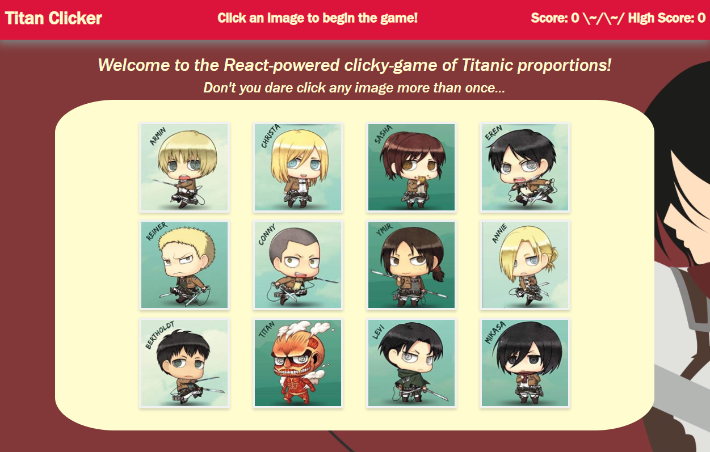

# Titan Clicker

## Description
This [web application](https://prophetrand.github.io/react-clicker/) deployed on GitHub Pages is a small React-powered memory game. Multiple React components work in unison to display stylized images of characters from the popular and excessively stressful anime Attack On Titan. Click on any image to start the game, and do your best to not click any image more than once. Each unique image clicked increases your score by 1, and the high score per page session is counted as well. Clicking on an image that you have already clicked on will reset the game and your score, while preserving the high score. 


## Table of Contents
* [Technologies Used](#technologies-used)
* [How to Access](#how-to-access)
* [What I Did](#what-i-did)
* [Code Snippets](#code-snippets)
* [Screenshots](#screenshots)
* [Acknowledgments](#acknowledgments*)
* [Who I Am](#who-i-am)

---

## Technologies Used
* [Javascript](https://www.javascript.com/) to develop the logic and dynamically-generated HTML included in this web application.
* [React](https://reactjs.org/) for building a dynamic, component-based UI for this webpage using JavaScript and JSX.
* [Git](https://git-scm.com/) for distributed version control, tracking changes over time and making them visible to collaborators.
* [Github](https://github.com/) for version control in the cloud, saving my changes and presenting them clearly to myself and others.

## How to Access
This web application is available on most browsers and is hosted on GitHub Pages. The site can be [accessed here](https://prophetrand.github.io/react-clicker/), and here: <https://prophetrand.github.io/react-clicker/>

---

## What I Did
Using React, from App.js I loaded the components Navbar and ItemCard and passed them props related to the stateful variables and functions defined in App.js. I equipped each image loaded through the ItemCard component with an onClick event listener, using React conventions, in order to advance the game appropriately based on whether or not the User has already clicked the target image or not.

## Code Snippets 
The code snippet below represents the majority of the logic for the game's functionality, as well as the state object used to track values through the App component.

```javascript
state = {
    chibis: chibis,
    score: 0,
    topScore: 0,
    clicked: [],
    message: "Click an image to begin the game!"
  }

selectChibi = (id) => {
    if (this.state.clicked.indexOf(id) !== -1) {
      // if the clicked image has an id that is in the "clicked" array, then it will have an index that does not equal -1. Score and clicked array are reset as a result.
      this.setState({
        score: 0,
        clicked: [],
        message: "Failure! But you can try again..."
      });
    } else {
      // if the clicked image conversely does not have its id in the "clicked" array, then its id is pushed into it. Then state.score increases by 1 and state.topScore increases if it has been surpassed.
      this.state.clicked.push(id);
      
      this.setState({
        score: this.state.score + 1,
        message: "Success! Push forward!"
      });

      if (this.state.score >= this.state.topScore) {
        this.setState({
          topScore: this.state.topScore + 1
        })
      }
    }
    this.shuffleChibi();
  }

```

## Screenshots
Example of the web application:


---

## Acknowledgments
* [W3Schools](https://www.w3schools.com/) has been my go-to for descriptive tutorials on HTML, CSS, and Javascript syntax and best practices. I am eternally grateful for their massive store of documentation.
* [MDN Web Docs](https://developer.mozilla.org/en-US/) is another resource for documentation on HTML, CSS, and Javascript that I find myself using more and more often as I work through deeper Javascript.

## Who I Am
My name is Rand Hale, and I am an aspiring programmer/web developer based in California.

* [LinkedIn](https://www.linkedin.com/in/rand-hale-83ba389b/)
* [GitHub](https://github.com/prophetrand)